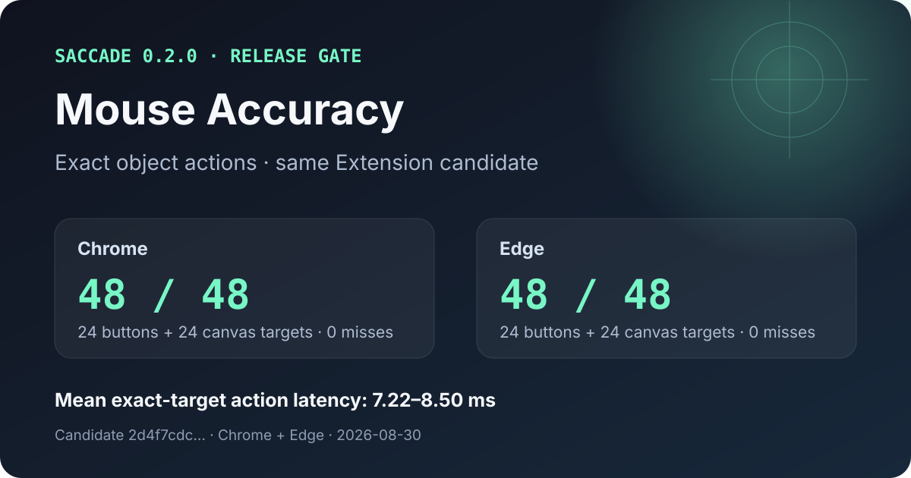

# Saccade

Saccade gives browser agents a small, current semantic view of one authorized
Chrome or Edge tab—and exact actions that return their own verification.

It is built for real browser work: signed-in admin pages, long forms, dynamic
controls, iframes, rich text, uploads, and pages that change while an Agent is
working. The Agent reads semantic objects instead of repeatedly transferring a
whole page, and the browser waits locally before an action is dispatched.

> Latest release: `@nanlogic/saccade` **0.2.2** with Extension **0.4.1**.
> This patch restores truthful runtime readiness and rejects stale Extension connections before command dispatch.
> [Release notes](docs/releases/0.2.2.md) · [0.2.0 Extension evidence](docs/reports/2026-08-30-saccade-0.2.0-release-gate.md)

## What it solves

- **One exact tab per request.** Every read and action names a leased `tab_id`;
  each tab has one writer and stays isolated from other Agent sessions.
- **Current page state without polling.** Ask for a bounded full view once,
  then read browser-pushed deltas after a known revision.
- **Actions that wait and verify locally.** Visibility, enabled state, stable
  geometry, topmost state, and current action authority are checked under one
  deadline. The receipt includes the resulting semantic transition.
- **Safe recovery.** A replaced object stays stale. An action with an ambiguous
  side effect is not replayed automatically.
- **Less model work on forms.** Independent fields can be preflighted and sent
  as one batch; submit, navigation, and upload remain explicit actions.

The result is a browser interface designed around what an Agent needs to know:
*which tab, which document, which revision, which object, and what changed*.

## Install

Saccade requires Node.js 18 or newer and the Saccade Extension in Chrome or
Edge.

```sh
npx -y @nanlogic/saccade install
npx -y @nanlogic/saccade doctor
```

During prerelease development, load the [`extension/`](extension/) directory as
an unpacked extension. The setup command adds the Saccade MCP server to
supported local Agent clients. Start a new Agent task after installation.

The configured MCP command is:

```text
npx -y @nanlogic/saccade mcp
```

## The six MCP tools

| Tool | What the Agent gets |
| --- | --- |
| `saccade.system.capabilities` | Live Broker, Extension, browser, and session readiness |
| `saccade.tabs.list` | Only the tabs leased to the current Agent session |
| `saccade.tabs.open` | A new authorized tab and its initial document identity |
| `saccade.tabs.close` | A bounded close of one session-owned tab |
| `saccade.truth.read` | A full semantic working set or a delta after one revision |
| `saccade.act` | One exact object action—or an independent form batch—with verification |

A typical task uses one capability check, one tab open, one useful first read,
then action receipts and deltas. The Agent does not need to re-read the full
page after every field.

## Controls in 0.2.0

| Family | Current semantic support |
| --- | --- |
| Text entry | text fields, search fields, text areas, number inputs, contenteditable and same-origin iframe editors |
| Choice | checkboxes, radios, switches, native selects, ARIA listboxes and comboboxes |
| Navigation | buttons, links, tabs and menu items |
| Files | standard file inputs and software upload triggers with value-free verification |
| Fast targets | exact moving `reflex_target` objects under a bounded local loop |
| Page structure | headings, paragraphs, lists, tables, rows, cells, status, alerts, images and frames |
| Composition | same-origin iframes and open shadow roots; restricted or opaque regions remain explicit in Truth |

The 0.2.0 release candidate passed deterministic controls, semantic tables,
same-origin iframe rich text, a five-step legacy administration form, standard
upload, replacement-stale handling, and Agent session isolation in both Chrome
and Edge. It also passed non-blocking compatibility checks on Selenium's web
form, DemoQA React, Angular Material, BestBuy, NaNMesh, NaNLogic, and Mythcast
Era. See the [release-gate report](docs/reports/2026-08-30-saccade-0.2.0-release-gate.md)
for the exact scope and limitations.

## Mouse Accuracy: 96/96 in the release gate

[](docs/evidence/release-0.2.0-mouse-accuracy.json)

The same Extension candidate hit 24/24 ordinary targets and 24/24 canvas
reflex targets in each browser, with zero misses in this run. Mean exact-target
action latency ranged from 7.22 ms to 8.50 ms. This is an object-addressed
software path: the Agent never guesses a screen coordinate.

The [machine-readable result](docs/evidence/release-0.2.0-mouse-accuracy.json),
the [test fixture](fixtures/conformance/mouse_accuracy.html), and the
[release report](docs/reports/2026-08-30-saccade-0.2.0-release-gate.md) are kept
together so the claim stays tied to its candidate and test conditions.

## Saccade and Playwright

Playwright is an excellent browser-testing and scripted-automation tool.
Saccade serves a different job: live Agent work in an authorized user tab.

| | Saccade | Playwright |
| --- | --- | --- |
| Best fit | Agent work in a current, authorized Chrome or Edge tab | Reproducible browser tests and scripted automation |
| Primary handle | Document-local semantic object identity and current action authority | Locators that resolve page elements |
| State flow | Canonical current Truth plus browser-pushed revision deltas | Page and locator queries plus assertions |
| Waiting | Local actionability checks and a semantic postcondition in the action receipt | Locator actionability checks and auto-retrying assertions |
| Isolation | Session-owned tab leases; one writer per tab | Clean browser contexts, commonly one per test |

The latest controlled same-model form comparison did **not** produce a blanket
winner. Saccade used 8 browser tool calls versus 10 and spent 1.52 s versus
6.88 s inside the browser MCP path. Playwright completed the full Agent task in
26.20 s versus Saccade's 38.78 s. The benchmark, prompt, caveats, and payload
measurements are in the [comparison report](docs/reports/2026-08-28-current-saccade-playwright-speed.md).

Use Playwright when the goal is a deterministic test suite. Use Saccade when an
Agent must stay attached to a user's current browser state, consume small
semantic updates, and know whether each action actually took effect.

Playwright's own documentation describes its
[actionability checks](https://playwright.dev/docs/actionability),
[locator strictness](https://playwright.dev/docs/locators#strictness), and
[browser-context isolation](https://playwright.dev/docs/browser-contexts).

## Truth and privacy

Saccade gives the Agent semantic roles, safe state, affordances, stable
document-local identity, current geometry, and explicit limitations. Protected
fields expose only protected state. Diagnostics retain bounded command and
failure metadata, not page contents, screenshots, cookies, credentials, or
editable values.

The Broker stores only bounded recovery metadata needed to preserve session and
tab ownership across a restart. A disconnected Agent's lease becomes orphaned;
the tab is neither closed nor transferred automatically.

## Development

```sh
./scripts/dev.sh test
./scripts/dev.sh broker
./scripts/dev.sh mcp
./scripts/dev.sh pack
```

Run the Chrome and Edge release gate against the exact connected candidate:

```sh
node scripts/gate_node_release_candidate.js \
  --base-url=http://127.0.0.1:8765 \
  --browsers=chrome,edge \
  --include-public \
  --output=/tmp/saccade-release-gate.json
```

The current product contracts live in [`docs/current/`](docs/current/). The
machine-readable control inventory is rendered in
[`docs/generated/control_coverage.md`](docs/generated/control_coverage.md).

## License

[Apache-2.0](LICENSE)
