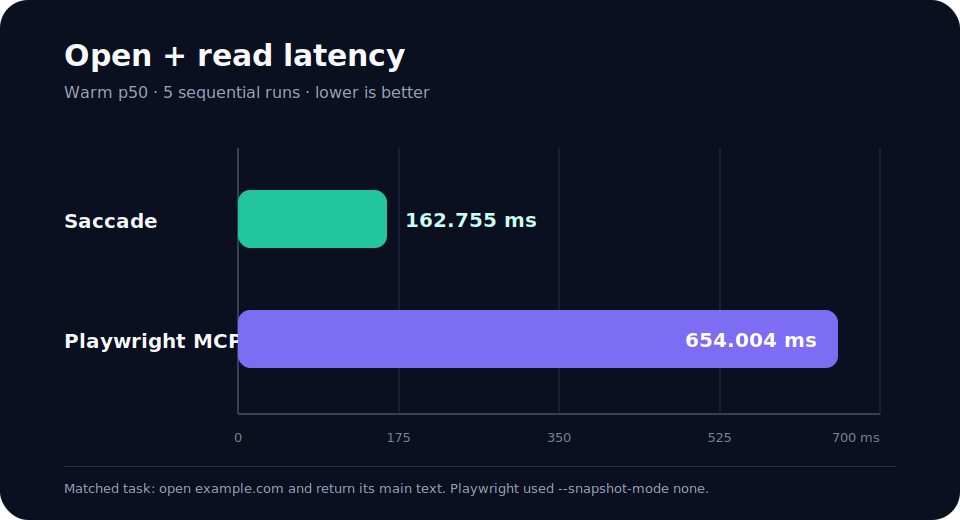
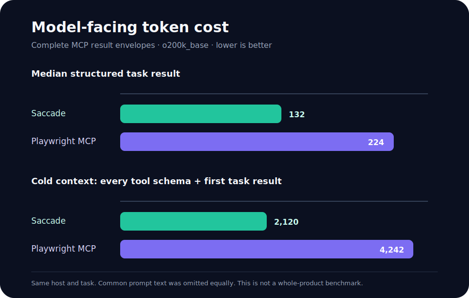

# Building a browser agent that can prove what it clicked

Status: release candidate. Do not publish until the dated macOS reflex evidence
pack replaces the media marker below.

Suggested slug: `/blog/browser-agent-native-input-receipts`

<!-- REFLEX_MEDIA: replace with a linked 6-second GIF preview and the uncut MP4. -->

Browser automation can usually prove that it sent a command. That is not the
same as proving what happened in the tab a person can see.

The page may change between observation and input. A responsive layout may
move the control. An overlay may cover it. A nested iframe may contain another
field with the same label. A framework may accept a value and erase it during
validation. An agent that reports success after the command was dispatched can
hide every one of these failures.

Saccade treats an action as a transaction inside one visible browser tab:

```text
human grants one tab
  -> browser emits a fact at revision N
  -> host chooses a revision-bound action
  -> browser applies native input
  -> renderer returns a matching receipt
  -> browser observes the result at revision N+1
```

If any boundary is missing, the action does not pass.

## A 15-second test of the local loop

MouseAccuracy is useful here because it removes semantic ambiguity. A target
appears, input either lands on it or it does not, and the page keeps its own
score.

For the public run, the current macOS build is configured through Saccade at
the highest settings exposed by the page: **Insane difficulty, Tiny targets,
15 seconds**. The host then makes one `saccade.web.reflex_run` call. Target
facts, native pointer input, and receipts stay in the local same-WebView route;
the language model does not choose each target.

The evidence pack is accepted only when the results page reports 100% target
efficiency and 100% click accuracy, the hit count equals the verified target
receipt count, and the hot loop reports zero LLM calls. A score without those
receipts is a failed run, even if the video looks correct.

The publication package contains two different artifacts:

- an uncut recording covering setup, the full 15-second round, and the settled
  result screen;
- a six-second loop for the article and README, linked to the full recording,
  sanitized report, value-free replay, manifest, and checksums.

The short loop explains the feature. The structured report decides whether it
passed.

## What the browser supplies

Saccade runs a CEF/Chromium desktop browser on macOS and Windows. The person and
agent share the normal visible tab. Agent access is granted per tab and can be
paused or revoked.

The browser exports redacted facts with a `page_revision` and layout epoch.
Actions are bound to that state. Immediately before input, Saccade refreshes
the action map and may perform one bounded local rebase if the same semantic
target still exists. A missing, covered, ambiguous, or stale target is rejected
before input. A successful dispatch still needs a same-WebView native-input
receipt.

Form work adds another transaction:

1. inventory the current fields and redacted state;
2. compile requested values into eligible and rejected fields;
3. execute one revision-bound plan;
4. read fresh state and match each write to a receipt.

This is why Saccade can refuse a partial fill. If a request names three fields
and the browser can identify only one, writing one value is not completion.

Passwords, one-time codes, card security codes, and government identifiers use
a separate browser-owned path. The model may learn that a protected field
needs human input, but it does not receive the value. Replays record target
class, revision, action identifier, outcome, and timing without recording form
values or browser credentials.

## A narrow benchmark against Playwright MCP

Playwright MCP is not screenshot-only. Its official documentation says that
the default agent path uses structured accessibility snapshots and element
references, and its tool surface covers cross-browser automation, network
mocking, storage, tracing, video, JavaScript evaluation, and more. That makes it
a strong developer automation surface, not a straw man for this comparison.

We measured one small task on the same Apple Silicon Mac: open
`https://example.com` and return its main text. Each structured lane ran five
sequential iterations. Playwright MCP used `--snapshot-mode none`, its
lower-output configuration for this task.





| Metric | Saccade | Playwright MCP | Difference |
| --- | ---: | ---: | ---: |
| Warm p50 open + main-text read | 162.755 ms | 654.004 ms | 75.1% lower time |
| Median structured task result | 132 tokens | 224 tokens | 41.1% fewer |
| All tool schemas + first task | 2,120 tokens | 4,242 tokens | 50.0% fewer |

Token counts include complete MCP result envelopes and use `o200k_base`.
Common prompt text was omitted equally. The result supports a claim about this
open-and-read task, not a claim that Saccade is always faster or smaller.

The raw benchmark report is
[`runs/benchmarks/playwright_parity_build49_evaluate_20260718/report.json`](../../runs/benchmarks/playwright_parity_build49_evaluate_20260718/report.json),
and the chart data is
[`docs/launch/data/playwright_open_read_build49.json`](data/playwright_open_read_build49.json).
The Playwright configuration and advertised features are described in the
[official Playwright MCP introduction](https://playwright.dev/mcp/introduction).

## Safety is a contract comparison, not a score

Assigning each product a made-up safety number would hide their different
purposes. The useful comparison is which boundary is built into each advertised
agent surface.

| Boundary | Saccade | Playwright MCP |
| --- | --- | --- |
| Human access model | Explicit grant to one visible tab; Agent On can be paused or revoked | Headed by default with persistent sessions; the public MCP introduction does not describe a per-tab human grant contract |
| Observation | Redacted same-WebView facts tied to page revision and layout epoch | Structured accessibility snapshots with element refs; optional vision mode |
| Action completion | Revision/target validation plus verified same-WebView native-input receipt | Tool completion and fresh page snapshots; no equivalent native receipt is documented in the advertised MCP surface |
| Protected values | Browser-owned protected-fill path keeps the value out of MCP output and replay | No equivalent protected-value channel is documented in the MCP introduction |
| Replay | Value-free action and receipt evidence | Tracing, video, console, and network debugging tools |
| Failure mode | Missing grant, truth, target, or receipt fails closed | General automation errors and assertions; a different contract optimized for test and automation workflows |

This table describes documented product surfaces. It does not prove that one
tool is secure in every deployment. Saccade's current adversarial fixture
measured zero protected-value or capability leaks, but broad prompt-injection,
shadow-DOM, and third-party security evaluation remain open work.

## Developer fit

The two tools are useful at different layers.

| Work | Better starting point | Why |
| --- | --- | --- |
| Cross-browser test suites | Playwright | Mature Chrome, Firefox, WebKit, and Edge automation with locators, assertions, tracing, network controls, and test-runner integration |
| Network mocking and storage-state setup | Playwright | First-class developer controls are part of the advertised MCP and Playwright APIs |
| Generate locators or execute arbitrary Playwright code | Playwright | Designed for test authoring and programmatic browser control |
| Agent works in the same persistent tab as a person | Saccade | Per-tab human grant, visible Agent state, revision-bound facts, and native receipts are the product boundary |
| Fill ordinary fields without exposing protected values | Saccade | Compiled form plan plus a separate protected-value channel |
| Diagnose why an agent action did not count | Saccade | Receipt, revision, target identity, and fresh postcondition remain linked in one replay |

Playwright's official [locator documentation](https://playwright.dev/docs/locators)
also matters here: DOM locators resolve an up-to-date element before every
action. Saccade's local geometry rebase is a scoped advantage for its own
coordinate and stable Canvas-surface paths, not a replacement for Playwright's
DOM locator behavior.

## PDF work is a different transaction

Saccade's DOCMAX path treats an AcroForm as a form, not as a rendered web page.
The packaged Build 85 smoke found five fields, filled two ordinary fields,
blocked three fields, verified the write receipt, and logged no values. A flat
PDF with no fillable fields returned `no_fillable_fields` instead of guessing.

Playwright MCP advertises `browser_pdf_save`, which exports a page as a PDF.
Playwright also has a mature page PDF API. Its advertised MCP surface does not
describe a PDF-form inventory, compile, protected-fill, and receipt contract.
That is a scope difference, not evidence that Playwright cannot display,
download, test, or generate PDFs. See the official
[Playwright `page.pdf` API](https://playwright.dev/docs/api/class-page#page-pdf).

## Current limits

Saccade remains experimental dogfood software. It targets ordinary Chromium
pages on macOS and Windows. Iframes, rich editors, virtualized controls,
downloads, PDF forms, and Canvas surfaces each need measured compatibility
gates. Site security checks stay with the person, and Saccade does not bypass
CAPTCHA or authentication challenges.

The repository contains milestone documents from older engines and builds.
Public claims point to dated evidence packs so a reader can inspect the build,
commit, platform, report, replay, recording, and checksums behind each result.

Source: [github.com/nanlogic/saccade](https://github.com/nanlogic/saccade).
Evidence method: [`docs/PUBLIC_EVIDENCE_GUIDE.md`](../PUBLIC_EVIDENCE_GUIDE.md).
