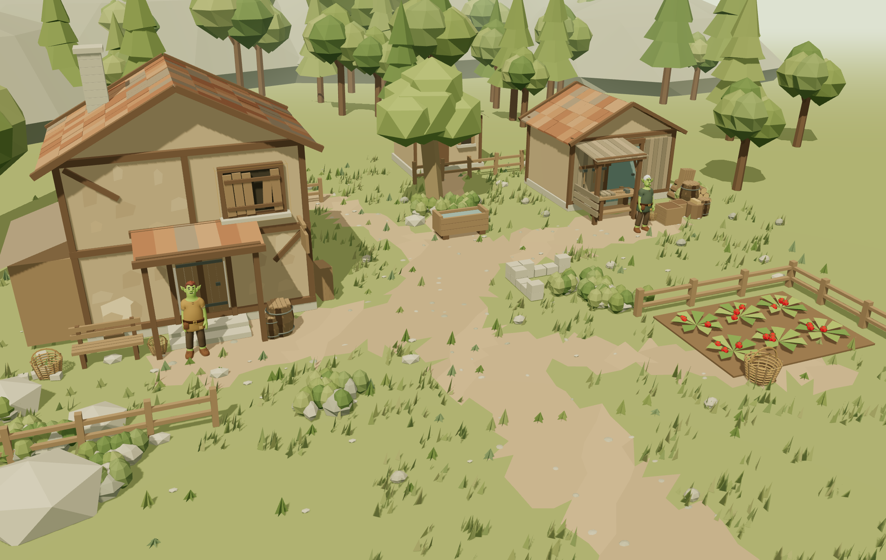
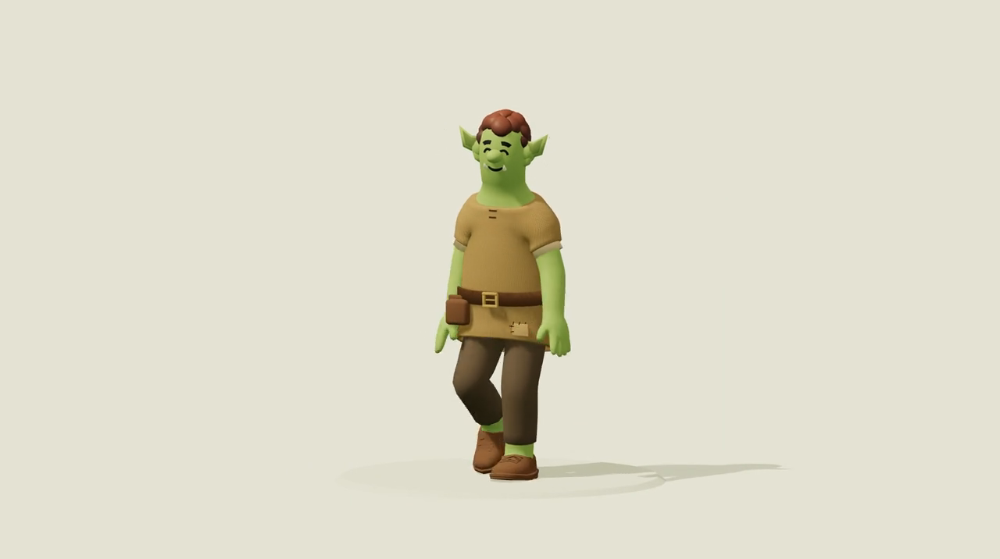
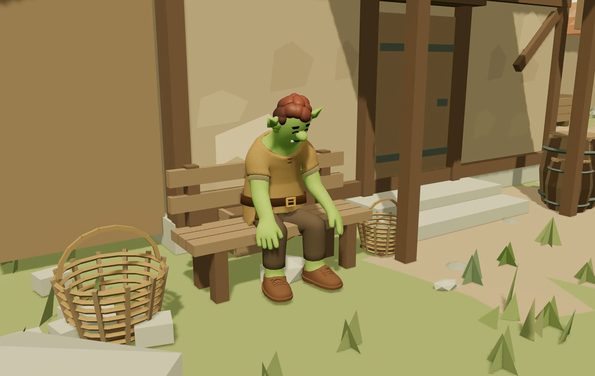

# Building Mythcastera with Blender Truth and Saccade

We started Mythcastera with a simple wish: a fantasy town where AI residents have things to do. An inn to run, supplies to gather, a place to sit, someone to talk to. Goblins, pigfolk, and creatures outside town belong in that world. We want their choices to have visible consequences.

Then we spent rather a lot of time staring at a goblin's shirt.

That detour has been useful. Before a resident can convincingly live in a town, we need to get a character into the scene, give it an action, and see what actually happens when it moves. This update is about that work, and the small town taking shape around it.

[Watch the 20-second town tour](https://github.com/nanlogic/saccade/blob/main/docs/showcase/2026-09-16/media/town-tour.mp4)

The scene now has an inn, a workshop, a strawberry patch, and the smaller things that make those places readable: baskets, crates, fences, and stacks of wood. We built and arranged the town assets through our Blender workflow. Mududu is the innkeeper; Kakka is the repairer. Their character definitions keep their appearance, background, and starting possessions separate from the animation files.

We're experimenting with resident behavior too, including walking to places, sitting, conversation, and gathering. Some household activities still use placeholder motion. The longer-term aim is a town whose residents can keep themselves occupied; this is still a development preview.

## Starting with a body that already works

Our characters began with a purchased, licensed library of rigged models. That gave us a useful starting point: an existing skeleton, skin weights, and native animation. We kept the shared 44-bone rig while making character variations and clothes in Blender.

The walking and running in these character studies originally came from that Blender asset. The fantasy clothing, species variations, and character-specific work are additions to that base. Keeping that distinction clear also helps us debug: we can compare a changed character with the original instead of guessing which part of the pipeline introduced a problem.

Mududu now uses a separate head-and-neck module on the shared rig. The earlier rough-cloth goblin remains useful for comparison, but it isn't the current Mududu asset.

[Watch the 15-second character reel](https://github.com/nanlogic/saccade/blob/main/docs/showcase/2026-09-16/media/mythcastera-residents.mp4)

These clips are manually staged motion demonstrations, not a demonstration of autonomous resident behavior.

## Getting a swing into the browser

For additional actions, we've been using Mixamo. Our upload candidate contains a skinned human mesh and its armature, exported in the rest pose with the existing animation removed. We download the chosen animation as an FBX with skin, at 30 fps, without keyframe reduction.

From there, we retarget locally and review the result. Some clips go back through Blender for adaptation; the combat lab can retarget and adjust timing directly in the browser. Three.js loads the character as GLB, while our shared runtime library loads reusable animation curves separately. That separation matters because adding another action shouldn't require rebuilding every character or hard-coding another preview button.

Two early combat experiments were Bayonet Stab, used as a spear thrust, and Great Sword Downward Slash. The source motions felt leisurely for the attacks we wanted. We tried a 1.5× overall speed, then compressed the actual strike interval further. The sword experiment also shortens part of the preparation.

We are leaving those attack clips out of this showcase while we correct the weapon presentation. Those settings are tuning choices for these clips. Different actions need different preparation and recovery. The combat previews still need work on weapon grip and character-specific contact; a convincing swing alone doesn't implement combat.

## What Blender Truth and Saccade helped us see

The visual and scene-inspection features below are from our Saccade development build. They are not included in the published 0.2.2 package / 0.4.7 Extension. This is a progress report, not a new release announcement.

Blender Truth gives the agent structured access to Blender state and operations. Saccade handles browser interaction and lets us inspect the running WebGL preview, including sampled image sequences and the application's reported animation state. We also used it to select and download the Mixamo candidates.

The two views answer different questions. Blender can expose geometry and attachment measurements. Browser footage shows the exported character under the actual runtime animation, lighting, and camera. We need both, and we still have to interpret the evidence carefully.

The shirt supplied a good example. We gave the goblin a loose, coarse-cloth tunic with rolled sleeves and small neckline details. A front view looked reasonable. Weight checks didn't raise an obvious problem. Later inspection showed a neckline detail floating away from the shirt, with a measured gap around 8.5–9 mm in the sampled poses.

We had not measured the attachment gap before calling the detail fixed. There is also a trap in using minimum distance alone: one end of a detail may touch while the other lifts away. We changed the neckline stitches into faces integral to the garment and added an attachment check across explicit animation frames. It reports maximum separation and the worst sampled frame and vertex, so a touching tip can't hide a raised end.

That check has limits. Sampled frames don't cover every instant, and unsigned surface distance doesn't prove that nothing penetrates. We pair the numbers with side-view motion inspection. The agent missed the original problem; the useful result was a better repair and a more specific check.

We're now able to spend more time on what the residents do. We'd like the next clips to show Mududu managing his inn, Kakka finding useful work, and the consequences of leaving the safety of town. There are still feet, hands, clothes, and transitions to fix along the way. At least we can now trace those problems through the same pipeline we'll use for the next character and the next action.

We're building [Saccade in public on GitHub](https://github.com/nanlogic/saccade). The [development showcase](https://github.com/nanlogic/saccade/tree/main/docs/showcase/2026-09-16) includes the clips and the limits of what we tested.

*Written with AI assistance from our development notes; the examples are from our own project.*

